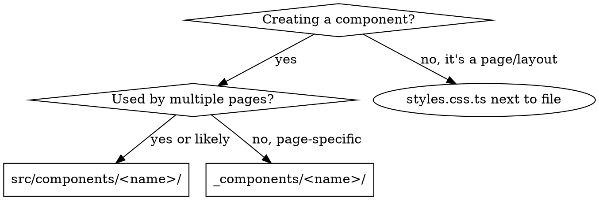

# File Colocation

## Overview

Every file has a home. Styles live next to their component. Page-specific components colocate under `_components/`. Reusable components live in `src/components/`.

## The Rule

```
page.tsx        → styles.css.ts       (page styles)
layout.tsx      → layout.css.ts       (layout styles)
page component  → _components/<name>/ (page-specific)
shared component → src/components/    (cross-page reusable)
```

## Directory Structure

```
src/
  app/
    about/
      page.tsx                          # imports from styles.css.ts
      styles.css.ts                     # Panda CSS recipes/styles for page
      layout.tsx                        # imports from layout.css.ts
      layout.css.ts                     # Panda CSS styles for layout
      _components/
        team-card/
          index.tsx                     # component implementation
          styles.css.ts                 # component styles
          team-card.test.tsx            # component tests
        value-card/
          index.tsx
          styles.css.ts
          value-card.test.tsx
  components/
    section-header/
      index.tsx                         # reusable across pages
      styles.css.ts
      section-header.test.tsx
```

## Decision Flowchart



## styles.css.ts Pattern

Extract Panda CSS styles into a colocated `.css.ts` file. The component file imports named exports.

```ts
// styles.css.ts
import { css } from '@styled/css';
import { stack } from '@styled/patterns';

export const wrapper = css({ maxW: '6xl', mx: 'auto', p: '8' });
export const heading = css({ fontSize: '4xl', fontWeight: 'bold' });
export const cardGrid = grid({ columns: { base: 1, md: 3 }, gap: '6' });
```

```tsx
// page.tsx
import * as s from './styles.css.ts';

export default function AboutPage() {
  return (
    <main className={s.wrapper}>
      <h1 className={s.heading}>About</h1>
      <div className={s.cardGrid}>{/* ... */}</div>
    </main>
  );
}
```

## Component Directory Pattern

Each component gets its own directory with three files:

```
_components/team-card/
  index.tsx           # component + imports from styles.css.ts
  styles.css.ts       # all Panda CSS styles
  team-card.test.tsx  # tests
```

```tsx
// _components/team-card/index.tsx
import * as s from './styles.css.ts';

type TeamCardProps = { name: string; role: string; initials: string };

export function TeamCard({ name, role, initials }: TeamCardProps) {
  return (
    <article className={s.card}>
      <div className={s.avatar}>{initials}</div>
      <h3 className={s.name}>{name}</h3>
      <p className={s.role}>{role}</p>
    </article>
  );
}
```

## The Three-File Rule

Every component directory MUST have exactly three files. No exceptions.

```
<name>/
  index.tsx        # component implementation (required)
  styles.css.ts    # all Panda CSS styles (required, even if small)
  <name>.test.tsx  # tests (required, at minimum a render test)
```

Missing any of these three files is a violation. Create all three when creating a component directory.

## Red Flags — STOP and Restructure

- Inline `css()` calls growing beyond ~5 in a single component file → extract to `styles.css.ts`
- Sub-component functions defined in `page.tsx` → move to `_components/<name>/`
- A component in `_components/` imported from another route → move to `src/components/`
- `page.tsx` exceeding ~80 lines → split components out

## Common Mistakes

| Mistake                                      | Fix                                         |
| -------------------------------------------- | ------------------------------------------- |
| All components in `page.tsx`                 | Split into `_components/<name>/index.tsx`   |
| Styles inline in component                   | Extract to colocated `styles.css.ts`        |
| Page-specific component in `src/components/` | Move to `_components/`                      |
| Missing test file                            | Add `<name>.test.tsx` alongside `index.tsx` |
| Component directory without `styles.css.ts`  | Always create even if small                 |
| `layout.tsx` styles inline                   | Extract to `layout.css.ts`                  |
