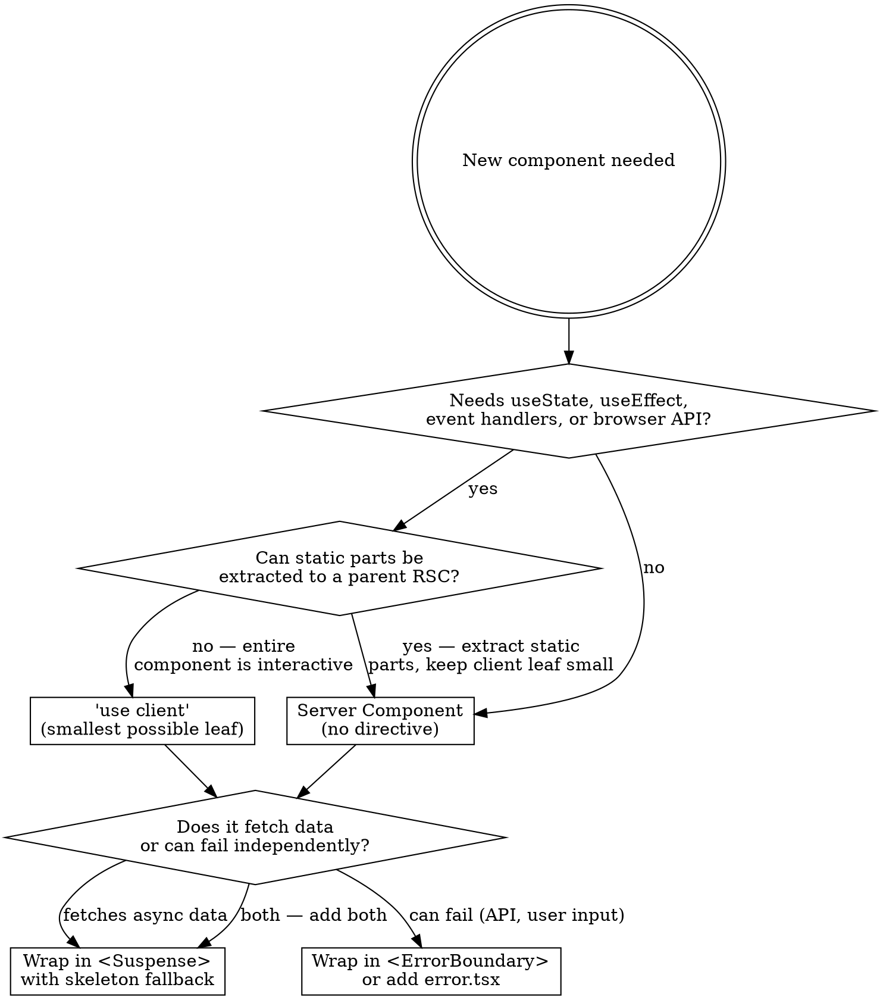

# RSC-First Architecture

## Core Principle

**Every component is a Server Component until proven otherwise.** Only add `'use client'` to the smallest leaf that genuinely needs browser APIs, event handlers, or hooks. Never make a parent client just because a child needs interactivity.

## Decision Flowchart



## Rules

### 1. RSC by Default

- No file gets `'use client'` without explicit justification
- Static text, layout, metadata, data fetching = always RSC
- `async/await` data fetching belongs in RSC, not in `useEffect`

### 2. Client Islands, Not Client Pages

Split interactive features into **small, independent client components**:

```
// BAD: One giant client component
'use client'
export function ProductsPage() { /* search + filter + sort + grid + cart */ }

// GOOD: Server page composing tiny client islands
// src/app/products/page.tsx (Server Component - NO directive)
export default function ProductsPage() {
  return (
    <main>
      <h1>Products</h1>                          {/* RSC: static */}
      <Suspense fallback={<SearchSkeleton />}>
        <SearchBar />                             {/* Client island */}
      </Suspense>
      <Suspense fallback={<FilterSkeleton />}>
        <PriceFilter />                           {/* Client island */}
      </Suspense>
      <Suspense fallback={<GridSkeleton />}>
        <ProductGrid products={products} />       {/* Client island (animation) */}
      </Suspense>
    </main>
  );
}
```

### 3. Fine-Grained Suspense Boundaries

Every async operation or client island that loads data gets its **own** `<Suspense>`:

| Boundary Scope                       | Fallback                 | Why                       |
| ------------------------------------ | ------------------------ | ------------------------- |
| Data-fetching RSC child              | Skeleton matching layout | Stream HTML progressively |
| Client island with `use()` promise   | Inline skeleton          | Independent loading state |
| Heavy client library (motion, chart) | Lightweight placeholder  | Don't block paint         |

**Never** wrap an entire page in a single `<Suspense>`. Each independent data source = separate boundary.

### 4. Fine-Grained ErrorBoundary

Every boundary that can fail independently gets its own error handling:

```
// Page-level: error.tsx (Next.js file convention)
src/app/products/error.tsx      → catches unhandled errors in segment

// Component-level: inline ErrorBoundary for independent failures
<ErrorBoundary fallback={<CartError />}>
  <Suspense fallback={<CartSkeleton />}>
    <CartWidget />
  </Suspense>
</ErrorBoundary>

<ErrorBoundary fallback={<FilterError />}>
  <Suspense fallback={<FilterSkeleton />}>
    <PriceFilter />
  </Suspense>
</ErrorBoundary>
```

**Rule:** If one component failing should NOT break the rest of the page, it needs its own `ErrorBoundary`.

### 5. Promise Streaming Pattern (Next.js 15+)

Pass unresolved promises from RSC to client, use React `use()` API:

```tsx
// RSC parent — start fetch, DON'T await
export default function Page() {
  const productsPromise = getProducts(); // no await
  return (
    <Suspense fallback={<GridSkeleton />}>
      <ProductGrid dataPromise={productsPromise} />
    </Suspense>
  );
}

// Client child — resolve with use()
'use client'
import { use } from 'react';
export function ProductGrid({ dataPromise }: { dataPromise: Promise<Product[]> }) {
  const products = use(dataPromise);
  return /* render */;
}
```

### 6. Shared State Boundaries

Context providers (`CartProvider`, `ThemeProvider`) force client boundaries. Minimize their scope:

```
// BAD: Provider wraps entire layout
<CartProvider>        ← everything below becomes client-renderable
  <Header />
  <main>{children}</main>
  <Footer />
</CartProvider>

// GOOD: Provider wraps only consumers
<Header>
  <CartProvider>      ← only cart UI is client
    <CartButton />
  </CartProvider>
</Header>
<main>{children}</main>    ← stays RSC
<Footer />                 ← stays RSC
```

### 7. Cross-Island State via URL

When multiple client islands need shared filter/sort state, use URL `searchParams` — NOT lifted React state or context:

```tsx
// RSC page reads searchParams for initial server fetch
export default async function Page({ searchParams }: { searchParams: Promise<Record<string, string>> }) {
  const params = await searchParams;
  const productsPromise = getProducts({ search: params.q, sort: params.sort });
  return (
    <SearchBar />           {/* writes ?q= via useRouter */}
    <SortSelect />          {/* writes ?sort= via useRouter */}
    <Suspense fallback={<GridSkeleton />}>
      <ProductGrid dataPromise={productsPromise} />
    </Suspense>
  );
}

// Each client island reads/writes its own param
'use client'
export function SearchBar() {
  const searchParams = useSearchParams();
  const router = useRouter();
  // read searchParams.get('q'), write via router.push
}
```

**Why URL over Context:** URL state is server-readable (RSC can filter on first render), shareable (copy/paste URL), and avoids a Context provider that widens the client boundary.

**Note:** `useSearchParams()` requires a `<Suspense>` boundary around any component using it.

## File Structure Pattern

```
src/app/products/
  page.tsx          ← RSC: metadata, data fetch, compose islands
  loading.tsx       ← Suspense fallback for route segment
  error.tsx         ← ErrorBoundary for route segment
src/components/products/
  search-bar.tsx    ← 'use client' (small island: input + debounce)
  price-filter.tsx  ← 'use client' (small island: range slider)
  sort-select.tsx   ← 'use client' (small island: dropdown)
  product-card.tsx  ← 'use client' (small island: animation + cart button)
  product-grid.tsx  ← RSC or client depending on animation needs
  cart-button.tsx   ← 'use client' (small island: click handler)
```

## Common Mistakes

| Mistake                               | Fix                                                                         |
| ------------------------------------- | --------------------------------------------------------------------------- |
| `'use client'` on page.tsx            | Remove — pages should be RSC. Extract interactive parts to child components |
| Single Suspense wrapping entire page  | Split into per-feature Suspense boundaries                                  |
| No ErrorBoundary anywhere             | Add error.tsx for route + inline ErrorBoundary for independent widgets      |
| `useEffect` for data fetching         | Move fetch to RSC with `async/await` or promise streaming                   |
| Context provider wrapping layout      | Narrow provider scope to only the consuming subtree                         |
| Monolithic 500+ line client component | Split into multiple small client islands                                    |
| Fetching in client then filtering     | Fetch in RSC, pass data as props, filter in small client island             |

## Rationalizations — Don't Fall For These

| Excuse                                               | Reality                                                                                                                |
| ---------------------------------------------------- | ---------------------------------------------------------------------------------------------------------------------- |
| "The whole page is interactive anyway"               | No. Static headings, metadata, layout, and data fetching are always server work. Split it.                             |
| "It's simpler to have one client component"          | Simpler now, worse UX. One failure kills everything. One slow fetch blocks everything.                                 |
| "Suspense at the page level is sufficient"           | Only if you have one data source. Multiple sources = multiple boundaries = progressive loading.                        |
| "I'll add ErrorBoundary later"                       | You won't. Add `error.tsx` for every route that fetches, and inline ErrorBoundary for independent widgets, now.        |
| "Context needs to wrap the layout for shared state"  | Use URL searchParams for filter/sort state. Reserve Context for truly local shared state (cart) and scope it narrowly. |
| "This client component is only 200 lines, it's fine" | 150 line limit. If it's over, there are static parts you can extract to RSC.                                           |

## Red Flags — STOP and Restructure

If you notice any of these, you are violating RSC-first:

- A `'use client'` file longer than 150 lines → split it
- A page.tsx with `'use client'` → remove directive, extract islands
- Only one `<Suspense>` on a page with multiple data sources → add more boundaries
- Zero `ErrorBoundary` or `error.tsx` on a page that fetches data → add error handling
- A Context provider wrapping `{children}` in a layout → narrow the scope
- "The whole page is interactive anyway" → no it isn't, split it
- Filters/sort sharing state via React Context instead of URL searchParams → refactor to URL
